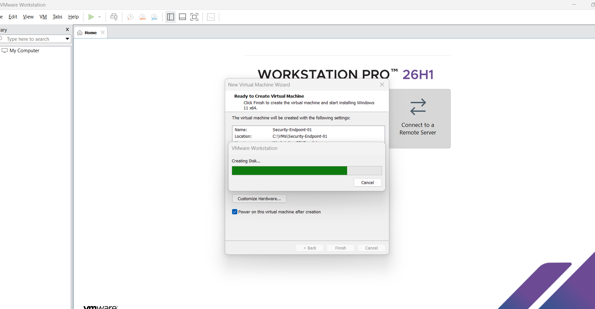

## Deployment Process

### 1. VMware Virtual Machine Configuration

The Windows 11 virtual machine was created and configured in VMware Workstation.

### 2. Windows 11 Installation

Windows 11 Pro was installed on the virtual machine.

### 3. UEFI / Boot Configuration

The VM was configured to use UEFI firmware and the Windows installation media was booted successfully.

